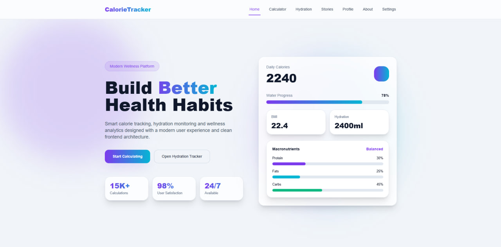
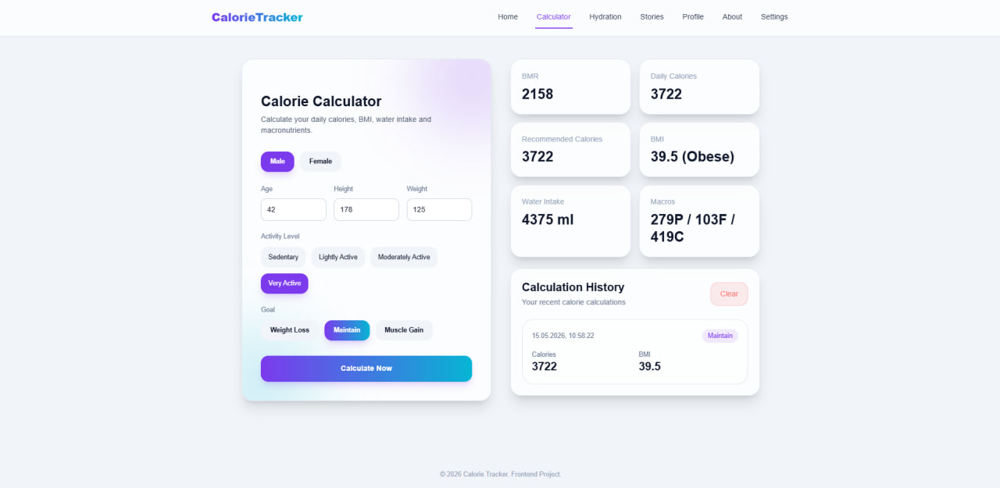
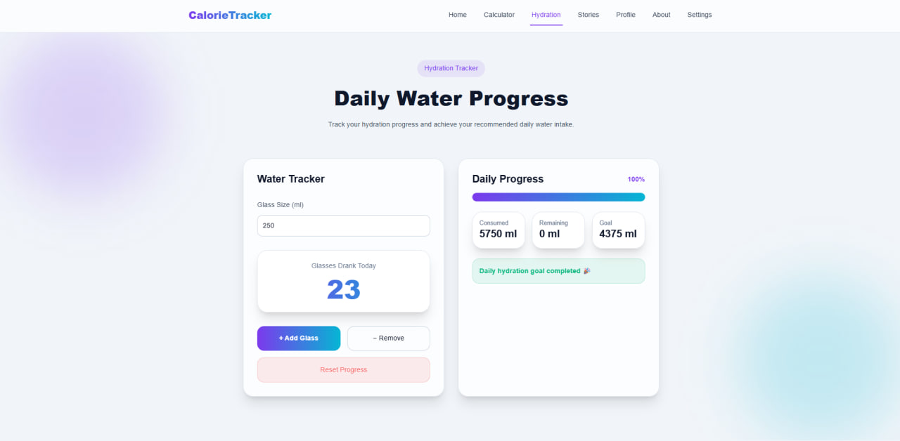
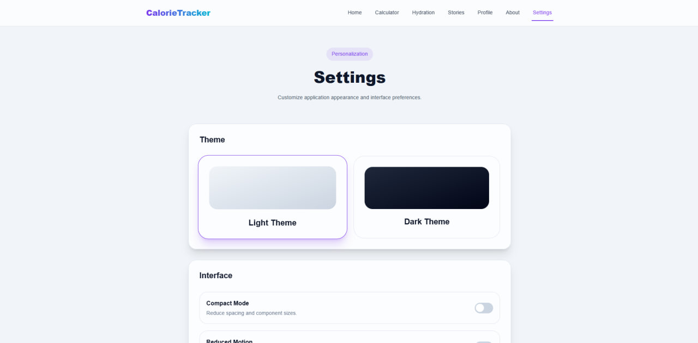

# Calorie Tracker

Modern frontend-only wellness application built with React, Vite and Tailwind CSS.

The project combines calorie calculation, hydration tracking, wellness analytics and user progress management into a clean, responsive and production-like frontend experience.

Designed as a university final project focused on:

- Clean Architecture
- Modern UI/UX
- React best practices
- Component composition
- Frontend scalability
- Local state management
- Responsive design

---

# Calorie Tracker


# Overview

Calorie Tracker helps users:

- Calculate daily calorie needs
- Track hydration progress
- Monitor BMI and macronutrients
- Store personal progress locally
- Build healthy habits through wellness tracking

The entire application works fully on the frontend without backend services or authentication.

---

# Screenshots

## Home Page



Modern SaaS-inspired landing page with wellness dashboard UI.

## Calculator



Interactive calorie calculator with responsive dashboard layout.

## Hydration Tracker




Daily water tracking system with progress analytics.

## Settings



Centralized application personalization system.

# Tech Stack

## Core Technologies

- React
- JavaScript
- Vite
- Tailwind CSS
- React Router DOM

---

# Key Features

## 1. Smart Calorie Calculator

Modern wellness calculator with personalized calculations.

### Supported calculations

- BMR (Basal Metabolic Rate)
- Daily calories
- Recommended calories
- BMI
- Water intake
- Macronutrients

### User inputs

- Gender
- Age
- Height
- Weight
- Activity level
- Fitness goal

### Supported goals

- Weight loss
- Weight maintenance
- Muscle gain

---

## 2. Hydration Tracker

Interactive water intake tracking system.

### Features

- Custom glass size
- Add / remove glasses
- Daily progress tracking
- Hydration goal progress bar
- Remaining water calculation
- Daily hydration completion state

### Additional functionality

- Connected to calorie calculator
- Uses calculated recommended water intake
- Automatically stores progress in localStorage

---

## 3. User Profile Dashboard

Personal wellness dashboard for tracking progress.

### Includes

- Personal profile information
- Water consumption statistics
- Daily hydration streak
- Saved user preferences
- Local progress persistence

---

## 4. Wellness Stories

Modern editorial-style wellness page using external API integration.

### Features

- Async API requests
- Loading states
- Error handling
- Responsive storytelling layout
- Wellness-inspired user stories
- Modern SaaS-like UI

---

## 5. Settings System

Centralized application settings page.

### Available settings

- Light theme
- Dark theme
- Compact UI mode
- Reduced motion mode

### Features

- Persistent settings
- Theme synchronization
- Modern toggle UI
- Centralized settings architecture

---

## 6. Calculation History

Stores recent user calculations locally.

### Features

- localStorage persistence
- Recent calculations
- Empty states
- Clear history functionality
- Modern dashboard layout

---

# UI / UX Features

The project follows modern SaaS and wellness dashboard design principles.

## Implemented UI features

- Glassmorphism cards
- Gradient backgrounds
- Smooth transitions
- Hover animations
- Modern mobile navigation
- Responsive layouts
- Compact form controls
- Interactive dashboard UI
- Modern active route navigation
- Dark / Light theme support

---

# Responsive Design

Fully optimized for:

- Mobile devices
- Tablets
- Desktop screens

The application uses responsive Tailwind utility classes and adaptive layouts.

---

# Project Architecture

The project uses compact but scalable frontend architecture.

## Folder Structure

```txt
src/
│
├── components/
├── pages/
├── services/
├── hooks/
├── utils/
├── data/
├── styles/
│
├── App.jsx
├── main.jsx
```

---

# Architecture Principles

The application follows modern frontend engineering principles.

## Principles Used

### DRY

Avoiding duplicated logic and reusable utilities/components.

### KISS

Keeping architecture simple and maintainable.

### Separation of Concerns

UI, business logic and storage are separated.

### Single Responsibility Principle

Each component and service has a focused responsibility.

### Composition over Inheritance

Reusable UI composition instead of complex inheritance patterns.

---

# Design Patterns Used

## Factory Pattern

Used in:

```js
calculatorFactory()
```

Responsible for creating calculator logic.

## Module Pattern

Used in:

- settingsService
- statisticsService
- profileService

Encapsulates application services and localStorage logic.

## Strategy Pattern

Used for:

- Goal-based calorie calculations
- Activity multipliers
- Macronutrient calculations

---

# State Management

The project intentionally avoids heavy state libraries.

## Used Approach

- React useState
- Custom hooks
- localStorage synchronization

No Redux or unnecessary Context API usage.

---

# Local Storage Persistence

The application stores:

- Theme settings
- Calculator history
- Last entered form
- Hydration progress
- User profile
- Hydration streaks
- User preferences
- Custom settings

---

# Custom Hooks

## useLocalStorage

Reusable hook for synchronizing React state with localStorage.

---

# Validation

Implemented validation includes:

- Empty field validation
- Invalid value prevention
- Positive number checks
- Form protection

---

# Error Handling

The application includes:

- API error handling
- Form validation errors
- Async request protection
- Empty states
- Fallback UI states

---

# Loading States

Implemented skeleton-style loading states for async content.

---

# Routing

## Application Routes

| Route | Description |
|---|---|
| `/` | Home Page |
| `/calculator` | Calorie Calculator |
| `/hydration` | Hydration Tracker |
| `/profile` | User Dashboard |
| `/statistics` | Wellness Stories |
| `/about` | Health & Nutrition Guide |
| `/settings` | Application Settings |

---

# Performance & Optimization

The project focuses on lightweight frontend architecture.

## Optimizations

- Minimal file count
- Reusable components
- Compact architecture
- Local-only data flow
- Efficient component structure

---

# Installation

## 1. Clone repository

```bash
git clone <repository-url>
```

## 2. Open project folder

```bash
cd calorie-tracker
```

## 3. Install dependencies

```bash
npm install
```

## 4. Start development server

```bash
npm run dev
```

---

# Required Packages

```bash
npm install react-router-dom
npm install -D tailwindcss postcss autoprefixer
```

---

# Production Build

```bash
npm run build
```

---

# Educational Goals

This project demonstrates:

- Modern React development
- Frontend architecture
- Clean code practices
- Responsive UI/UX
- API integration
- Reusable component design
- Local state management
- Frontend scalability

---

# Future Improvements

Possible future features:

- Charts & analytics
- Weekly reports
- Nutrition plans
- Workout tracking
- Notifications
- Progressive Web App support
- Export statistics
- Multi-language support

---

# Project Type

Frontend-only wellness and calorie tracking platform.

- No backend
- No authentication
- No server-side logic

---

# Author

Wellness frontend application built with React and Tailwind CSS.